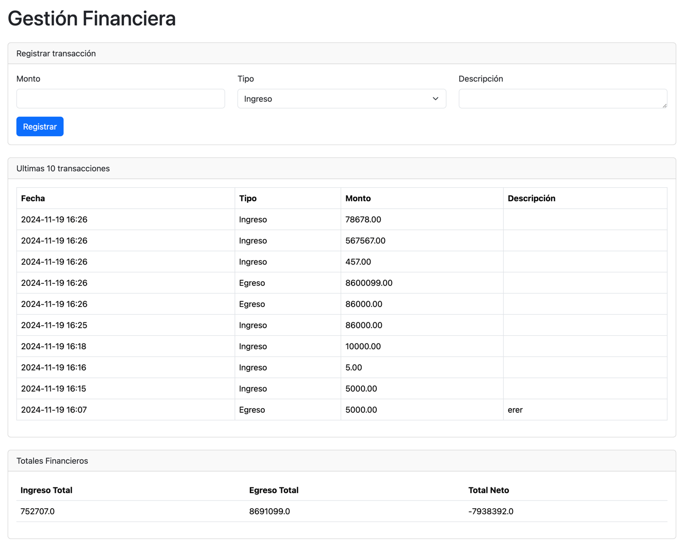

# **Gestión Financiera**

## **Descripción del Sistema**



El sistema de Gestión Financiera es una aplicación que permite a los usuarios registrar y gestionar sus transacciones financieras de forma sencilla. Los usuarios pueden:
- Registrar ingresos y egresos.
- Consultar un historial de transacciones.
- Visualizar los totales financieros, incluyendo ingresos, egresos y el balance neto.

La aplicación está desarrollada con **Spring Boot** para el backend y utiliza **Thymeleaf** para la generación de las vistas en el frontend.

---

## **Manual de Usuario**

### Funcionalidades

1. **Registrar una Transacción**
    - Selecciona el tipo de transacción: *Ingreso* o *Egreso*.
    - Ingresa el monto y la descripción de la transacción.
    - Haz clic en el botón **Registrar Transacción** para guardar la información.

2. **Consultar el Historial**
    - En la misma interfaz, encontrarás una tabla con todas las transacciones registradas, ordenadas por fecha.
    - Cada fila incluye detalles como monto, tipo, descripción y fecha.

3. **Ver Totales Financieros**
    - En la parte inferior de la tabla, se muestran los totales actualizados automáticamente:
        - Total de Ingresos.
        - Total de Egresos.
        - Balance Neto (Ingresos - Egresos).

---

## **Guía de Configuración y Despliegue**

### Prerrequisitos

- Base de datos **MySQL**.
- **IDE** recomendado: IntelliJ IDEA.
- Navegador web moderno para la interfaz gráfica.

### Configuración del Proyecto

1. **Clonar el Repositorio**
      ```bash
    git clone https://github.com/julianmp0/parcial-final
    cd parcial-final
      ```
2. **Instalar Dependencias**
   Desde la raíz del proyecto, ejecuta el siguiente comando para descargar las dependencias:
      ```bash
      ./gradlew build
      ```

3. **Ejecutar la Aplicación**
   Inicia el servidor:
      ```bash
      ./gradlew bootRun
      ```
4. **Acceder la Aplicación**  [http://localhost:8080](http://localhost:8080).
---
## **Tecnologías Utilizadas**

- **Backend**: Spring Boot, Spring Data JPA, Hibernate.
- **Frontend**: Thymeleaf, Bootstrap.
- **Base de Datos**: MySQL.
- **Herramientas de Construcción**: Gradle.
